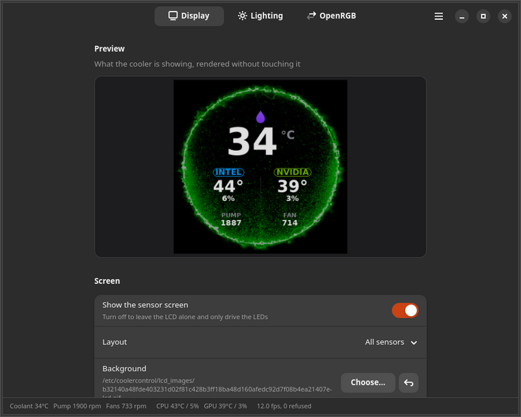
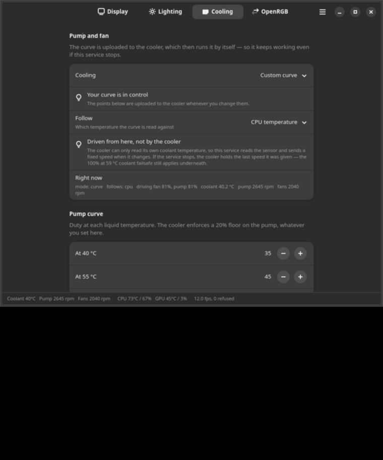

# Kraken Unleashed

Live CPU, GPU and coolant stats on an **NZXT Kraken 2024 Elite** LCD, drawn over
your own animated GIF, on Linux — at the same frame rate the Windows software
manages, not a slideshow.

<p align="center">
  
  
  
</p>

<p align="center">
  
  
</p>

It also drives the cooler's own ring and fan LEDs, which OpenRGB cannot do on
this firmware.

```bash
git clone https://github.com/ssjrocks/kraken-unleashed.git
cd kraken-unleashed
sudo ./install.sh
```

That's it. The service starts, survives reboots and sleep, and you configure it
from the **Kraken Unleashed** app in your applications menu (or
`/etc/kraken-unleashed.conf`, or `kraken-unleashed-ctl`).

It also drives the cooler's ring and fan LEDs with its own effects — or hands
them to **OpenRGB**, which cannot talk to this cooler directly but can drive it
through the built-in E1.31 relay. See [docs/RGB.md](docs/RGB.md).

> **Windows:** an experimental service + CLI build is on the
> [releases page](https://github.com/ssjrocks/kraken-unleashed/releases).
> It has not been tested on hardware yet — see [docs/WINDOWS.md](docs/WINDOWS.md).

---

## Why this exists

The Kraken's LCD has two completely different ways in, and every Linux tool used
the slow one.

| | Bucket upload | q565 streaming |
|---|---|---|
| Used by | liquidctl, CoolerControl, OpenKraken | SignalRGB, NZXT CAM — and this |
| How | write a 1.6 MB raw RGBX image into device memory, then switch to it | push a compressed frame straight at the panel |
| Payload | 1.6 MB | ~230 KB |
| Ceiling | **~2.4 fps** | **~12 fps** |

2.4 fps is why every Linux attempt at this looks like a slideshow. The fast path
is a QOI-style compressed format the firmware calls `q565`, and it was not
documented anywhere — it was lifted from a USB capture of SignalRGB and
reconstructed opcode by opcode. [docs/PROTOCOL.md](docs/PROTOCOL.md) has the
whole format, including the parts that are still unsolved.

The result runs at **12 fps for about 7% of one CPU core**.

## What you need

- An **NZXT Kraken 2024 Elite** or **Elite V2** (USB ID `1e71:3012`),
  with its internal USB 2.0 header cable connected. Other Krakens are
  recognised but **unverified** — see [supported coolers](#supported-coolers)
- Linux with systemd
- Python 3.9+ with `numpy`, `Pillow` and `pyusb` (the installer handles these on
  apt, dnf, pacman and zypper)

Not supported: the Kraken Z-series (`1e71:3008`) and the 2023 Elite use a
different LCD protocol. They may work via the bucket path in liquidctl, but not
with this.

> **Read [docs/TROUBLESHOOTING.md](docs/TROUBLESHOOTING.md) before you modify the
> streaming code.** Pushing frames at this device without flow control can drop
> it into its bootloader, and recovering from that needs the power supply
> switched off at the wall — a reboot will not do it. The shipped code paces
> frames and waits for each acknowledgement specifically to avoid this.

## Making it yours

Open the app and change what you like — it shows a live preview of the screen,
rendered **without touching the cooler**, so you can audition a background or
layout instantly.

Everything is scriptable too, and applies immediately with no restart:

```bash
kraken-unleashed-ctl set lcd.gif=~/Pictures/my-loop.gif
kraken-unleashed-ctl set lcd.style=cpu_gpu lcd.dim=0.55
kraken-unleashed-ctl set led.effect=rainbow led.params.period=8
kraken-unleashed-ctl preview /tmp/lcd.png
kraken-unleashed-ctl status
```

Settings live in `/etc/kraken-unleashed.conf` if you would rather edit a file
(then `sudo systemctl restart kraken-unleashed`).

The full guide — picking a good GIF, the three layouts, the LED effects, changing
colours and fonts, adding your own sensor screen or effect — is in
[docs/CUSTOMISING.md](docs/CUSTOMISING.md).

## Supported coolers

The protocol work was done on one cooler. The rest are recognised from
liquidctl's device table and will start, but nobody has confirmed they work —
`kraken-unleashed-ctl diagnose` tells you which category yours is in.

| USB ID | Cooler | LCD | Status |
|---|---|---|---|
| `1e71:3012` | Kraken 2024 Elite RGB | 640×640 | **verified on hardware** |
| `1e71:300c` | Kraken 2023 Elite | 640×640 | untested |
| `1e71:300e` | Kraken 2023 | 240×240 | untested |
| `1e71:3014` | Kraken 2024 Plus | 240×240 | untested |
| `1e71:3008` | Kraken Z53/Z63/Z73 | 320×320 | untested, and may not support the streaming path at all |

Trying an untested one is safe: the LCD waits for the cooler's acknowledgement
before sending each frame, so a model that does not speak this protocol refuses
and the service stops rather than pushing at it. If yours works — or doesn't —
[say so](https://github.com/ssjrocks/kraken-unleashed/issues).

## Documentation

| | |
|---|---|
| [INSTALL.md](docs/INSTALL.md) | Installing, upgrading, removing; distro notes |
| [CUSTOMISING.md](docs/CUSTOMISING.md) | Backgrounds, layouts, colours, writing your own screen |
| [TROUBLESHOOTING.md](docs/TROUBLESHOOTING.md) | Black screen, flicker, bootloader recovery, conflicts |
| [PROTOCOL.md](docs/PROTOCOL.md) | The LCD protocol, both paths, the q565 format |
| [RGB.md](docs/RGB.md) | The cooler's LEDs, effects, and letting OpenRGB drive them |
| [WINDOWS.md](docs/WINDOWS.md) | The experimental Windows build, and the driver step it needs |
| [ARCHITECTURE.md](docs/ARCHITECTURE.md) | How the pieces fit, who owns the device, the frame loop |

## Playing nicely with other software

Only the **LCD** is single-owner — the frame data goes over a USB interface that
one process claims exclusively. Cooling, lighting and status all share the HID
interface, so other software can use those at the same time.

- **CoolerControl / liquidctl** — can own the pump and fans while this owns the
  screen, which is the same split as FanControl + SignalRGB on Windows. Set
  `cooling.mode` to `firmware` so the two don't both write curves. Just don't
  let CoolerControl drive the *LCD*.
- **OpenRGB** — cannot drive this cooler's LEDs at all; the firmware rejects its
  packets. Turn on the **E1.31 relay** and OpenRGB drives them through this
  service instead. See [RGB.md](docs/RGB.md).
- **liquidctl** — don't run it against this device while the service is up.

The service publishes the cooler's readings to
`/run/kraken-unleashed/status.json` (and `/run/kraken-lcd/status.json`, the 1.x
path, so existing exporters keep working) so other tools can read liquid
temperature and pump/fan RPM without opening the device. See
[ARCHITECTURE.md](docs/ARCHITECTURE.md).

## Credits and licence

**GNU AGPL v3 or later** — see [LICENSE](LICENSE) and [NOTICE](NOTICE).

In short: you can use, modify and redistribute this, but derivative works have
to stay open under the same licence. If you run a modified version where others
interact with it over a network, you have to offer them its source too.

The sensor-screen renderer in `src/ok/` is vendored from
[OpenKraken](https://github.com/davidboulay/OpenKraken) by David Boulay and
stays under its original **MIT** licence (MIT is AGPL-compatible, so the
combined work ships under the AGPL without relicensing OpenKraken's code). Three
small changes are noted in [src/ok/README](src/ok/README). Credit for how these
screens look belongs there.

The protocol work stands on [liquidctl](https://github.com/liquidctl/liquidctl)'s
KrakenZ3 driver for the bucket path and the device's command vocabulary.

`q565` is a variant of [QOI](https://qoiformat.org/) by Dominic Szablewski.
