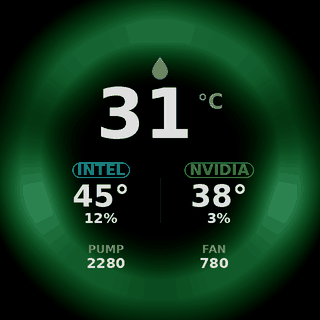
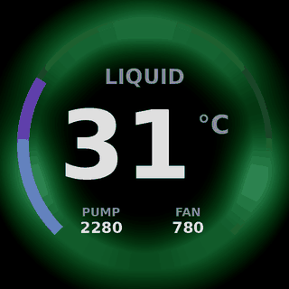
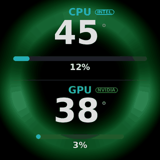

# Kraken Unleashed

Live CPU, GPU and coolant stats on an **NZXT Kraken 2024 Elite** LCD, drawn over
your own animated GIF, on Linux — at the same frame rate the Windows software
manages, not a slideshow.

<p align="center">
  
  
  
</p>

It also drives the cooler's own ring and fan LEDs, which OpenRGB cannot do on
this firmware.

```bash
git clone https://github.com/ssjrocks/kraken-unleashed.git
cd kraken-unleashed
sudo ./install.sh
```

That's it. The service starts, survives reboots and sleep, and reads its settings
from `/etc/kraken-lcd.conf`.

---

## Why this exists

The Kraken's LCD has two completely different ways in, and every Linux tool used
the slow one.

| | Bucket upload | q565 streaming |
|---|---|---|
| Used by | liquidctl, CoolerControl, OpenKraken | SignalRGB, NZXT CAM — and this |
| How | write a 1.6 MB raw RGBX image into device memory, then switch to it | push a compressed frame straight at the panel |
| Payload | 1.6 MB | ~230 KB |
| Ceiling | **~2.4 fps** | **~12 fps** |

2.4 fps is why every Linux attempt at this looks like a slideshow. The fast path
is a QOI-style compressed format the firmware calls `q565`, and it was not
documented anywhere — it was lifted from a USB capture of SignalRGB and
reconstructed opcode by opcode. [docs/PROTOCOL.md](docs/PROTOCOL.md) has the
whole format, including the parts that are still unsolved.

The result runs at **12 fps for about 7% of one CPU core**.

## What you need

- An **NZXT Kraken 2024 Elite** or **Elite V2** (USB ID `1e71:3012`),
  with its internal USB 2.0 header cable connected
- Linux with systemd
- Python 3.9+ with `numpy`, `Pillow` and `pyusb` (the installer handles these on
  apt, dnf, pacman and zypper)

Not supported: the Kraken Z-series (`1e71:3008`) and the 2023 Elite use a
different LCD protocol. They may work via the bucket path in liquidctl, but not
with this.

> **Read [docs/TROUBLESHOOTING.md](docs/TROUBLESHOOTING.md) before you modify the
> streaming code.** Pushing frames at this device without flow control can drop
> it into its bootloader, and recovering from that needs the power supply
> switched off at the wall — a reboot will not do it. The shipped code paces
> frames and waits for each acknowledgement specifically to avoid this.

## Making it yours

Everything lives in `/etc/kraken-lcd.conf`:

```jsonc
{
    "gif": "/home/you/Pictures/my-loop.gif",  // null = the bundled demo
    "style": "triple",                        // triple | liquid_ring | cpu_gpu
    "dim": 0.4,                               // 0 = bright background, 1 = black
    "rotate": 90,                             // match how your cooler is mounted
    "fps": 12
}
```

```bash
sudo systemctl restart kraken-lcd
```

Preview any combination without touching the cooler:

```bash
python3 /opt/kraken-lcd/kraken_lcd.py --rotate 0 --preview /tmp/lcd.png
```

The full guide — picking a good GIF, the three layouts, changing colours and
fonts, adding your own sensor screen — is in
[docs/CUSTOMISING.md](docs/CUSTOMISING.md).

## Documentation

| | |
|---|---|
| [INSTALL.md](docs/INSTALL.md) | Installing, upgrading, removing; distro notes |
| [CUSTOMISING.md](docs/CUSTOMISING.md) | Backgrounds, layouts, colours, writing your own screen |
| [TROUBLESHOOTING.md](docs/TROUBLESHOOTING.md) | Black screen, flicker, bootloader recovery, conflicts |
| [PROTOCOL.md](docs/PROTOCOL.md) | The LCD protocol, both paths, the q565 format |
| [RGB.md](docs/RGB.md) | The cooler's LEDs, and syncing them with the rest of your lighting |
| [ARCHITECTURE.md](docs/ARCHITECTURE.md) | How the pieces fit, who owns the device, the frame loop |

## Playing nicely with other software

Exactly one program may hold this cooler's USB interface. If CoolerControl,
OpenRGB or liquidctl also has it, you get flicker, a black screen, or garbage
temperature readings.

- **CoolerControl** — disable the Kraken device in its UI. Fan and pump curves
  you set there stay in the cooler's firmware and keep working.
- **OpenRGB** — disable the NZXT Kraken detector; this service drives those LEDs.
- **liquidctl** — don't run it against this device while the service is up.

The service publishes the cooler's readings to `/run/kraken-lcd/status.json` so
other tools can read liquid temperature and pump/fan RPM without opening the
device. See [ARCHITECTURE.md](docs/ARCHITECTURE.md).

## Credits and licence

MIT — see [LICENSE](LICENSE).

The sensor-screen renderer in `src/ok/` is vendored from
[OpenKraken](https://github.com/davidboulay/OpenKraken) by David Boulay (MIT),
with three small changes noted in [src/ok/README](src/ok/README). Credit for how
these screens look belongs there.

The protocol work stands on [liquidctl](https://github.com/liquidctl/liquidctl)'s
KrakenZ3 driver for the bucket path and the device's command vocabulary.

`q565` is a variant of [QOI](https://qoiformat.org/) by Dominic Szablewski.
