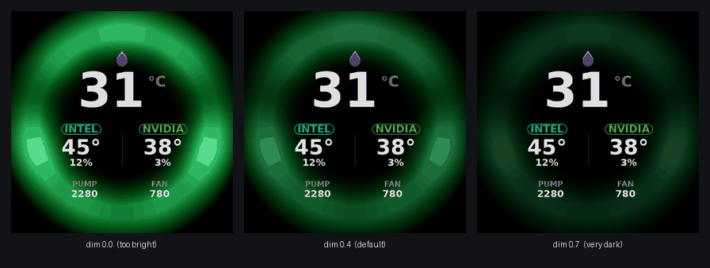

# Customising the display

Everything on this page is changed in one file:

```bash
sudo nano /etc/kraken-lcd.conf
sudo systemctl restart kraken-lcd
```

The file is JSON, except that lines starting with `//` are stripped before
parsing, so it can explain itself.

---

## Try before you commit

You do not have to restart the service and squint at the cooler to see what a
change does. The program can render exactly what it would send and write it to a
PNG, **without opening the device at all**:

```bash
python3 /opt/kraken-lcd/kraken_lcd.py --rotate 0 --preview /tmp/lcd.png
xdg-open /tmp/lcd.png
```

Every option works with `--preview`, so you can audition a change in a second:

```bash
python3 /opt/kraken-lcd/kraken_lcd.py --rotate 0 --preview /tmp/lcd.png \
    --style cpu_gpu --gif ~/Pictures/loop.gif --dim 0.55 --ring FF0066
```

`--rotate 0` shows it the right way up on screen. Leave it out and you get the
frame as actually transmitted, which is rotated to suit the cooler's mounting.

Command-line options always win over the config file, so this never disturbs
your installed settings. When you like what you see, write the same values into
`/etc/kraken-lcd.conf` and restart.

---

## The background

```jsonc
"gif": "/home/you/Pictures/my-loop.gif"
```

Any animated GIF, or a still PNG/JPEG. `null` uses the bundled demo.

**The one rule that matters: the middle should be dark.** The sensor readout is
*lightened* over your background — bright pixels in the background win, and
anything busy or pale behind the numbers makes them unreadable. GIFs built
around a glowing rim, a dark vignette, or a transparent/black centre look
fantastic. A full-frame bright animation looks like a mess.

Other practical notes:

- **Square.** It is resized to 640 × 640 regardless, so anything else gets
  squashed. The corners are not visible — the panel is a circle.
- **Resolution.** 480 × 480 is plenty; it is upscaled and then dimmed. Going
  higher mostly costs RAM.
- **Length.** Every frame is decoded and held in memory at startup. A 20-frame
  loop costs a few tens of MB; a 500-frame clip will hurt.
- **Frame delays** are honoured, clamped to a 20 ms minimum.

If a GIF looks too busy, raise `dim` before giving up on it.

## Brightness of the background

```jsonc
"dim": 0.4
```

`0` leaves the background at full brightness, `1` makes it black. The default
0.4 suits most GIFs.



## Which numbers are shown

```jsonc
"style": "triple"
```

| `triple` | `liquid_ring` | `cpu_gpu` |
|:---:|:---:|:---:|
|  |  |  |
| Coolant, CPU and GPU together, with pump and fan RPM | Big coolant temperature in an arc | CPU and GPU side by side |

Any sensor that is missing shows as `--` rather than disappearing, so a machine
with no NVIDIA GPU still gets a sensible screen.

## Getting it the right way up

```jsonc
"rotate": 90
```

Depends entirely on how your cooler sits on the CPU. Valid values are `0`, `90`,
`180` and `270`. There is no clever way to detect it — try one, look at the
cooler, try the next:

```bash
for r in 0 90 180 270; do
  echo "trying $r"
  sudo systemctl stop kraken-lcd
  sudo python3 /opt/kraken-lcd/kraken_lcd.py --rotate $r --seconds 8
done
```

Then put the winner in the config and `sudo systemctl start kraken-lcd`.

## Frame rate

```jsonc
"fps": 12
```

12 is the practical ceiling for this panel and costs about 7% of one core. Lower
it if you would rather have the CPU back — 8 still looks smooth, 4 is visibly
steppy. Going above 12 does not help; the device will start refusing frames, and
the code will stop rather than push through it.

## The arc colour

```jsonc
"ring": "7C3AED"
```

Hex RRGGBB, used for the liquid-temperature arc. Only `liquid_ring` and
`cpu_gpu` draw one — the `triple` layout deliberately has no arc, so the
background GIF provides the rim instead.

The arc turns amber and then red on its own as the coolant warms past the warning
thresholds, whatever you set here.

---

## The cooler's own LEDs

```jsonc
"led": {
    "enabled": true,
    "follow": "/etc/rgb-sync.json",
    "color": "00FF00",
    "period": 5.0,
    "min_brightness": 0.0,
    "max_brightness": 1.0,
    "gamma": 2.2
}
```

The pump ring and the radiator fans breathe a single colour: `color` at the peak,
fading to `min_brightness` and back every `period` seconds. `gamma` 2.2 makes the
fade look even to the eye rather than mathematically even.

Set `"enabled": false` to leave the LEDs alone entirely — useful if you would
rather something else drove them, though note that most things can't; see
[RGB.md](RGB.md).

**`follow`** is the interesting one. If that file exists, its `color`, `period`,
`min_brightness`, `max_brightness` and `gamma` are used instead of the values
here. That is how the cooler stays in exact step with
[rgb-sync](RGB.md#rgb-sync) driving the rest of your lighting — both read one
file, and both compute the breath from `CLOCK_BOOTTIME`, which every process on
the machine shares. No coordination, no drift. Set it to `null` if you are not
using rgb-sync.

---

## Going further: editing the renderer

The screens are drawn by `/opt/kraken-lcd/ok/backend/lcd_render.py`, vendored
from [OpenKraken](https://github.com/davidboulay/OpenKraken). It is ordinary
Pillow drawing code and it is meant to be edited.

### Colours

Near the top of that file:

```python
_BG       = (13, 14, 18)      # background — see the warning below
_ACCENT   = (124, 58, 237)    # NZXT purple
_TEXT     = (236, 237, 241)   # the big numbers
_TEXT_DIM = (139, 142, 152)   # labels like PUMP / FAN
_OK       = (52, 211, 153)    # below the warning threshold
_WARN     = (251, 191, 36)    # amber
_CRIT     = (239, 68, 68)     # red
_CPU      = (56, 189, 248)    # CPU accents
_GPU      = (52, 211, 153)    # GPU accents
```

> **Don't change `_BG`.** Compositing works by subtracting the renderer's
> background from the rendered screen, which leaves only the lit pixels to
> lighten over your GIF. If `_BG` is not the actual background colour of the
> rendered image, that subtraction leaves a visible rectangle. It is imported by
> `kraken_lcd.py` for exactly this purpose.

### Thresholds

```python
_LIQUID_MIN = 20.0      # arc empty
_LIQUID_MAX = 60.0      # arc full
```

### Fonts

The renderer looks for DejaVu Sans Bold, then Liberation Sans Bold, then Noto
Sans Bold, at the usual Debian and Arch paths, and falls back to a bitmap font if
none is found (which looks rough — install `fonts-dejavu-core` or equivalent).
To use something else, add its path to the top of `_FONT_CANDIDATES`.

### Writing your own screen

Add a function that takes an `LcdData` and returns a 640 × 640 `Image`, then
register it:

```python
def _render_mine(data: LcdData) -> Image.Image:
    img = Image.new("RGB", (CANVAS, CANVAS), _BG)
    draw = ImageDraw.Draw(img)
    draw.text(CENTER, f"{data.cpu_temp:.0f}°", font=_font(180),
              fill=_TEXT, anchor="mm")
    return img

_RENDERERS["mine"] = _render_mine
```

`LcdData` gives you `liquid_temp`, `cpu_temp`, `cpu_load`, `gpu_temp`,
`gpu_load`, `pump_rpm`, `fan_rpm`, `cpu_vendor`, `gpu_vendor` and `ring_color`.
**Any of them can be `None`** when a sensor is missing, so guard before
formatting.

Keep content within `SAFE_RADIUS` of `CENTER` — the panel is a circle and the
corners are simply not there.

Then `"style": "mine"` in the config. Check it with `--preview` first; an
exception in a renderer takes the service down.

Verify your styles are registered with:

```bash
python3 /opt/kraken-lcd/kraken_lcd.py --list-styles
```

> Edits to `lcd_render.py` live in `/opt/kraken-lcd/` and are **overwritten by
> `install.sh`**. Make your changes in a clone of the repo (`src/ok/backend/`)
> and install from there, so an upgrade keeps them.

---

## All options at a glance

| Config key | CLI | Default | Meaning |
|---|---|---|---|
| `gif` | `--gif` | bundled demo | background image |
| `style` | `--style` | `triple` | which readout |
| `dim` | `--dim` | `0.4` | background dimming, 0–1 |
| `ring` | `--ring` | `7C3AED` | liquid arc colour |
| `fps` | `--fps` | `12` | frames per second |
| `rotate` | `--rotate` | `90` | 0/90/180/270 |
| `led.enabled` | `--no-leds` | `true` | drive the cooler's LEDs |
| — | `--preview PATH` | — | render one frame to a file and exit |
| — | `--seconds N` | `0` | run for N seconds then stop |
| — | `--list-styles` | — | print available styles |
| — | `--config PATH` | `/etc/kraken-lcd.conf` | use a different config |
